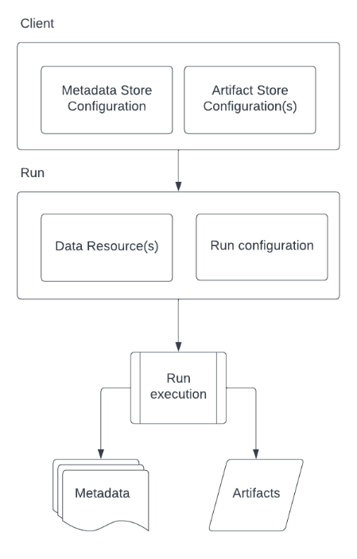

Datajudge Workflow
==================

Typical Datajudge workflow:

An user initially configures Reosurces, Stores and Run operations:

.. code-block:: python

    import datajuge as dj

    # Metadata Store
    METADATA_STORE = dj.StoreConfig(title="Local Metadata Store",
                                    type="local",
                                    name="local_md",
                                    uri="./djruns")

    # Artifact Store
    STORE_LOCAL_01 = dj.StoreConfig(name="local",
                                    type="local",
                                    uri="./djruns",
                                    isDefault=True)

    # Data Resource
    RES_LOCAL_01 = dj.DataResource(path="path-to-data",
                                name="example-resource",
                                store="local")

    # Example constraint
    CONSTRAINT_01 = dj.ConstraintFrictionless(type="frictionless",
                                            title="Example frictionless constraint",
                                            name="example-const",
                                            resources=["example-resource"],
                                            field="field-to-validate",
                                            fieldType="string",
                                            constraint="maxLength",
                                            value=11,
                                            weight=5)

    RUN_CFG = dj.RunConfig(
            inference=[
                {
                    "library": "frictionless"
                }
            ],
            validation=[
                {
                    "library": "frictionless"
                }
            ],
            profiling=[
                {
                    "library": "pandas_profiling",
                    "execArgs": {"minimal":True, "progress_bar":False}
                }
            ]
    )

Then creates a Client and a Run:

.. code-block:: python

    client = dj.Client(metadata_store=METADATA_STORE,
                    store=[STORE_LOCAL_01])

    run = client.create_run([RES_LOCAL_01],
                            RUN_CFG,
                            experiment="EXP-NAME")

And finally execute the Run:

.. code-block:: python

    with run:

        # Execute inference
        run.infer()

        # Execute profiling
        run.profile()

        # Execute validation for a list of constraints
        run.validate(constraints=[CONSTRAINT_01])

        # Log a datajudge schema into the metadata store
        run.log_schema()

        # Log a datajudge profile into the metadata store
        run.log_profile()

        # Log a datajudge report into the metadata store
        run.log_report()

        # Artifacts produced by choosen inference/validation/profiling framework are persisted in the default artifact store.
        # Persist an inferred resource schema
        run.persist_schema()

        # Persist a profile
        run.persist_profile()

        # Persist a validation report
        run.persist_report()
